# 🔭 GitObservatory

## GitHub Repository Analytics & Comparison Platform

GitObservatory is an end-to-end Data Engineering project that compares GitHub repositories using real engineering metrics rather than popularity alone.

The project automatically ingests GitHub repository metadata, pull requests, issues, contributors, workflow executions, and code review information through the GitHub REST API. The data is processed using the Medallion Architecture (Bronze → Silver → Gold) on Azure Databricks before being presented through an interactive Streamlit dashboard.

The platform enables users to compare open-source repositories based on engineering health, development activity, workflow reliability, and community engagement.

---

# Technology Stack

- Azure Databricks
- Delta Lake
- PySpark
- Spark SQL
- GitHub REST API
- Azure Databricks Workflows
- Unity Catalog
- Streamlit
- Plotly
- Python

---

# Repository Selection

Users simply provide two GitHub repository URLs and choose an analysis window. Once submitted, the application automatically triggers the Azure Databricks pipeline.

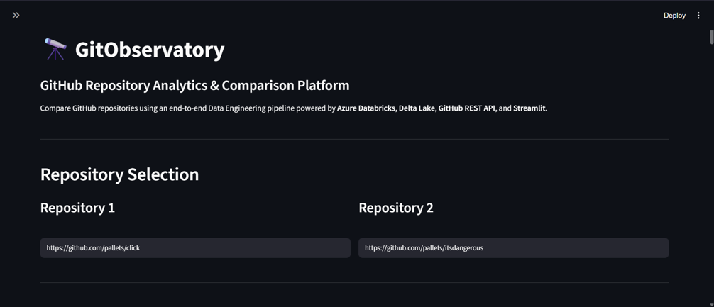

---

# Pipeline Execution

After validation, an Azure Databricks Workflow orchestrates the complete Medallion pipeline from data ingestion to dashboard generation.

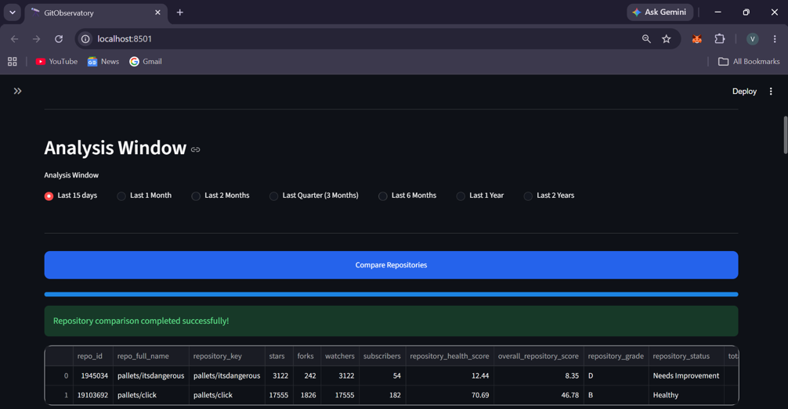

---

# Repository Overview

The dashboard presents a side-by-side comparison of both repositories, including:

- Repository Health Score
- Repository Grade
- Repository Status
- Stars
- Forks
- Watchers

This provides a quick executive summary before exploring detailed analytics.

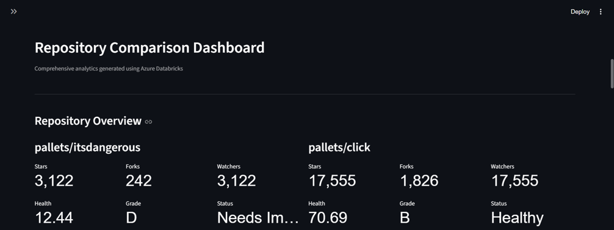

---

# Key Performance Indicators

GitObservatory computes engineering KPIs including:

- Repository Health Score
- Merge Rate
- Issue Closure Rate
- Workflow Success Rate
- Approval Rate
- Average Contributor Activity

These metrics are calculated from the processed Gold layer.

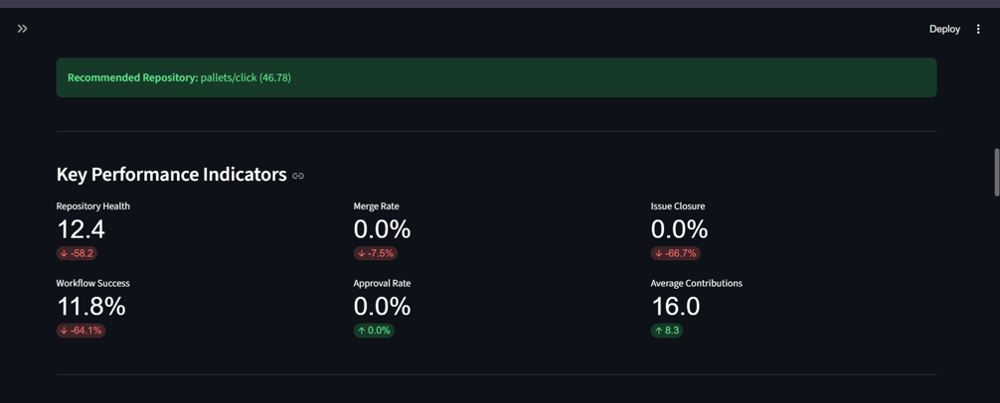

---

# Visual Analytics

Interactive Plotly visualizations compare repository performance across multiple engineering dimensions.

Available charts include:

- Repository Health Score
- Pull Request Analytics
- Issue Closure Rate
- Contributor Activity
- Workflow Success Rate
- Overall Repository Radar Comparison

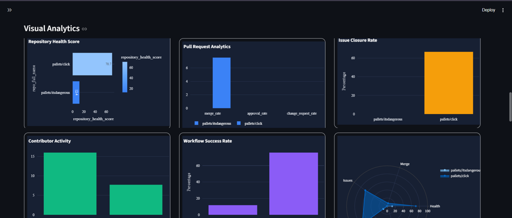

---

# Repository Insights

The dashboard automatically generates repository recommendations and engineering observations based on the computed analytics.

Examples include:

- Repository recommendation
- Merge efficiency comparison
- CI/CD reliability
- Community activity
- Issue management effectiveness

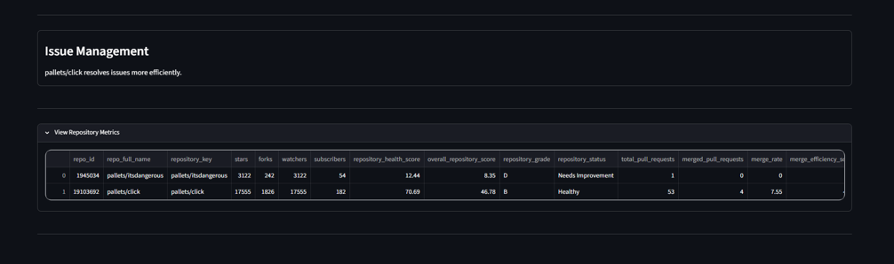

---

# Medallion Architecture

The project follows the Medallion Architecture implemented in Azure Databricks.

```
GitHub REST API
        │
        ▼
Bronze Layer
Raw GitHub API ingestion
        │
        ▼
Silver Layer
Data cleansing & transformation
        │
        ▼
Gold Layer
Engineering KPIs & Repository Scores
        │
        ▼
Streamlit Dashboard
```

---

# Azure Databricks Workflow

The complete ETL process is orchestrated using Azure Databricks Workflows.

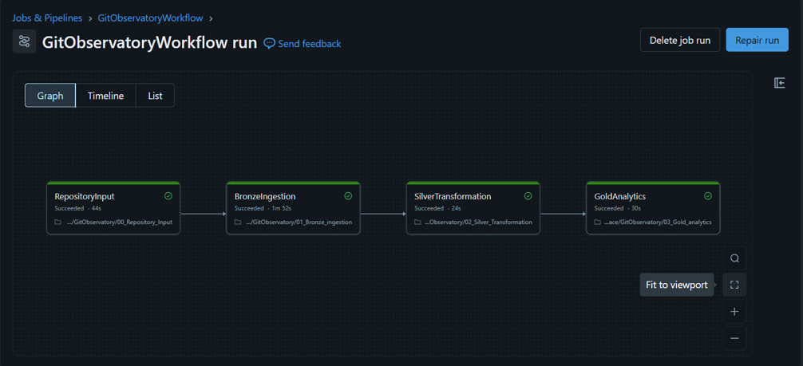

---

# Workflow Monitoring

Each notebook is executed sequentially, ensuring successful completion of Bronze, Silver, and Gold transformations.

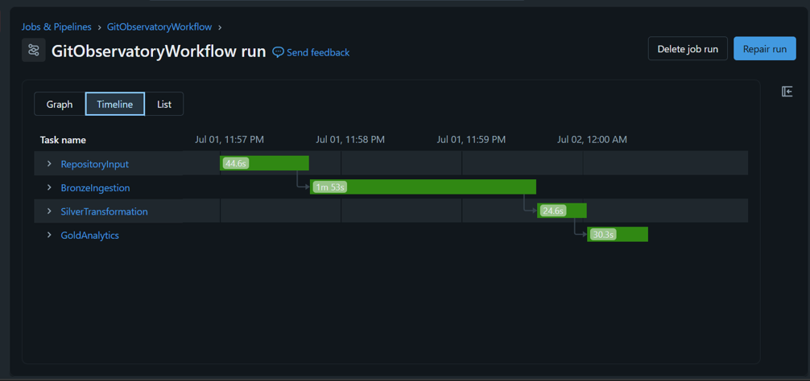

---

# Successful Pipeline Execution

Once all tasks complete successfully, the Gold analytics tables are refreshed and made available to the dashboard.

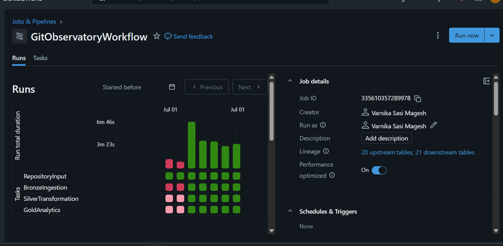

---

# Unity Catalog

Unity Catalog manages all Bronze, Silver, and Gold Delta tables while providing centralized governance for the project.

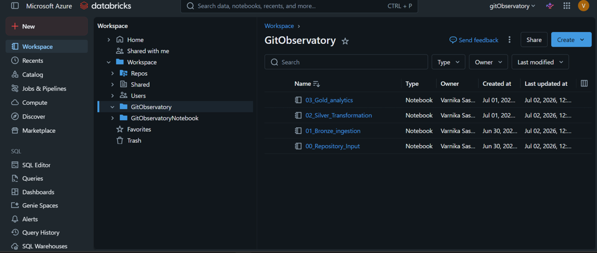

---

# Gold Layer Analytics

The Gold warehouse stores repository-level KPIs and comparison metrics that power the Streamlit dashboard.

Metrics include:

- Repository Health Score
- Overall Repository Score
- Repository Grade
- Repository Status
- Merge Rate
- Issue Closure Rate
- Workflow Success Rate
- Contributor Metrics

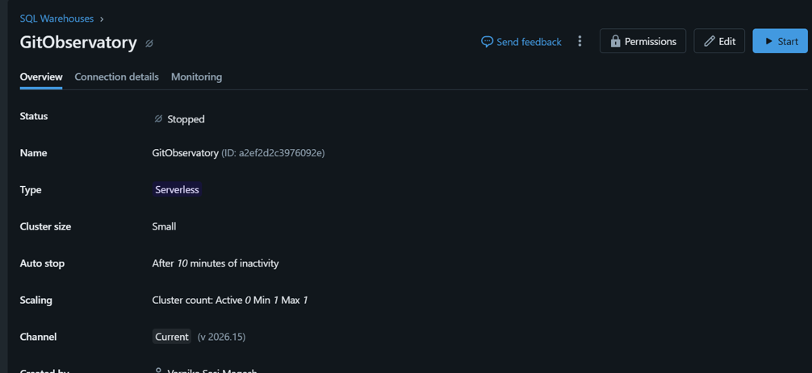

---

# Key Features

- Compare any two public GitHub repositories
- Automated Azure Databricks Workflow
- Medallion Architecture implementation
- Bronze, Silver and Gold Delta tables
- Repository Health Score
- Repository Grade Classification
- Interactive Plotly dashboards
- Repository comparison insights
- Engineering KPI computation
- Streamlit frontend

---

# Future Enhancements

- AI-powered repository recommendations using Large Language Models
- Historical repository trend analysis
- Multi-repository comparison
- Repository risk prediction
- Natural language repository explanations
- GitHub Actions integration
- Time-series engineering analytics

---

# Author

**Varnika Sasi Magesh**

GitObservatory was developed as a hands-on Data Engineering project to apply Azure Databricks, Delta Lake, Medallion Architecture, PySpark, GitHub REST API integration, workflow orchestration, and interactive analytics in a real-world engineering use case.
